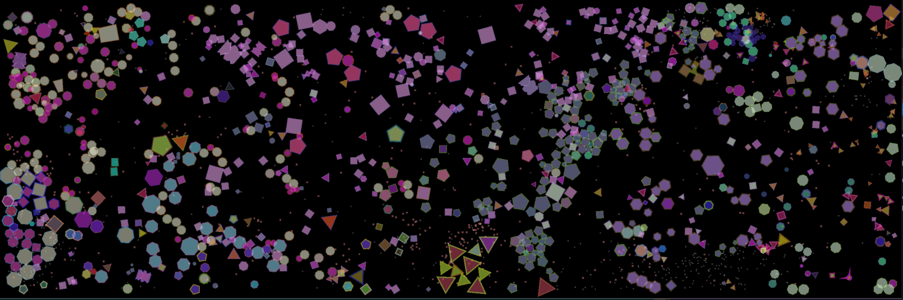

**volv** is a portable and customizable evolution simulator. **volv** uses AI with predisposed behaviours dictated by organism **DNA** to pit organisms against each other. Each organism moves, eats, attacks, flees, mates, and protects offspring to survive, and as unique species develop, they work together to ensure their survival.



These are organisms in volv. Each organism is uniquely defined by a strand of DNA, or a set of 'genes' belonging to each organism that determine every trait for an individual. Here is one such organism, recently born, looking for food.


This organism has colours, size, shape, and movement patterns defined by some unique combination of various 'genes' in it's DNA. Each organism has 100 genes, and some distinct combination of these genes determine everything about this organism. Some genes are more important than others and may contribute to size, speed, and a certain colour, while others may not matter at all.

If this organism survives long enough, it matures to become an adult. When an organism becomes an adult it becomes larger and develops different colours. It also requires more food (small white squares) to survive. If this adult organism is able to remain well fed and find another adult with similar DNA, they can mate to create offspring.


Offspring are generated when 2 adult organisms mate, and have DNA dictated by a combination of each of their parents and some random mutation. Just like in real life, if the parents have very similar DNA the offspring will have more mutations.
This system of mating produces unique species, and organisms born from similar parents will look for members of their same species to mate with when they become adults. Below is a section of **volv** with 2 distinct species: the green pentagons and the smaller light green triangles.


These species will tend to stick together; young organisms will follow adults of their species, adults will protect their young from competing species and predators, and species will try to avoid organisms of other species.

Carnivorous species can also develop, requiring different food from their herbivorous counterparts (eating larger red squares that spawn only from dead organisms). These species can be spotted by their non-equal sided shape, unlike the simple polygons of the herbivorous organisms. Below we can see a herbivorous square species and a carnivorous purple species.


Organisms can randomly become sick with a virus when they eat. Some organisms get sick more easily than others, and this virus is shown as a colourful dot in the middle of the organism. The virus is guaranteed to kill the organism, and if the sick organism comes in contact with a healthy one, there is a chance the virus will be passed on. The more similar the DNA is between the organisms, the more likely the virus will be passed on. This makes diseases spread quickly through single species but not so easily between species, just like in real life. Some organisms are able to detect when a neighbour is sick and try to flee. Below we can see a virus spreading through many similar organisms.


Each organism has the following traits determined by DNA:

Trait | Description
--- | ---
Radius | The size of the organism
Speed | The movement speed, inversely proportional to size
Attack | The amount of attack damage this organism can do to others, higher for carnivores, proportional to size
Immunity | How resistant this organism is to any virus
Fear | How scared this organism is of other organisms
Hunger | How much food this organism requires to be full
Vitality | Total amount of health this organism has, proportional to size
Metabolism | How quickly food energy is burned, proportional to speed
Mating Cool-down | How often this organism can mate
Lifespan | The maximum lifespan of the organism, proportional to size and inversely to metabolism
Vision | How far the organism can see around it, for both food and other organisms
Diet | Whether the organism is a herbivore or carnivore

**volv** is in development. The [current working build](https://github.com/TysonKlein/volv/blob/master/bin/volv.exe) can be found as an executable in the 'bin' folder. **volv** has simple controls while the simulation is running:  
**Press 'u' to toggle unlocked framerate mode**  
**Press Space to toggle developer mode, showing AI decisions (coloured line on each organism) and collision has squares**  
**Left Click to spawn a new random organism**  
**Right Click to spawn a barrier**  
**Press esc to end the simulation**  

To run **volv**, download the current working build and simply run it for default settings. You can also run it with CMD with the following code for a simulation with the same default settings:
```
volv
```
If you want to customize the simulation further, **volv** has a robust set of command line options. For example, if you wanted to run **volv** with 1000 organisms in a simulation space 4000 wide by 2500 tall in fullscreen mode with a seed of '5', you would type the following in command line:
```
volv -fn 1000 -x 4000 -y 2500 -s 5
```

Below is the list of all command line arguments that can be used with **volv**:
```
Evolutionary algorithm simulator
Usage:
  volv [OPTION...]

  -h, --help  Print help

 Display options:
  -f, --fullscreen      Fullscreen mode
  -d, --developer_mode  Toggle developer mode - shows AI decision making and
                        desired direction of travel

 Engine options:
      --x_buff arg              Horizontal edge buffer (default: 30)
      --y_buff arg              Vertical edge buffer (default: 30)
  -c, --collision_square_size arg
                                Side length of each hash-table collision
                                square (default: 100)
  -u, --unlimited_framerate     Unlock fame rate

 Simulation options:
  -y, --height arg            Simulaton Height (default: 1500)
  -x, --width arg             Simulaton Width (default: 1800)
  -n, --number_organisms arg  Number of unique organisms to start simulation
                              (default: 100)
  -s, --seed arg              Simulation seed, random seed if not specified
                              (default: Random)
      --food_density arg      Food spawn density (default: 15)
```

